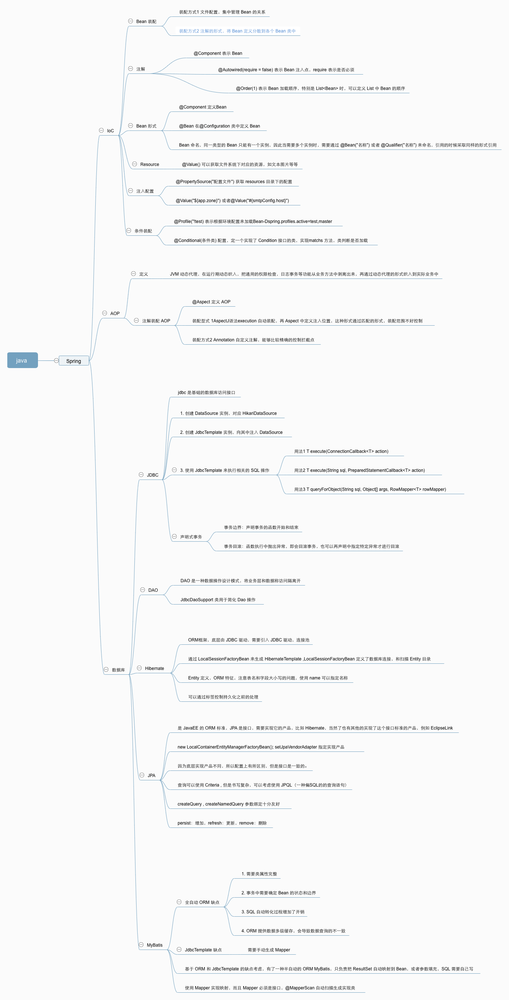

# Srping 




## 前言

本项目主要是记录学习 java 开发过程中的开发笔记和部分功能理解。
期间还会阅读其他的Java相关知识，比如 JVM 模型，内存调优等等。
有利于加深对 Java 与其体系的理解。

## IoC 容器 和 Bean 初步

Bean 的定义有多种目前集中表现为
1. 配置文件，类的定义和 Bean 声明是分开的，IoC 容器通过配置文件来搜索 Bean
2. 通过注解定义，@Component 注解表示当前类是一个 Bean

IoC 容器的定义有多种目前集中表现为
1. 通过 IoC 容器创建类调用配置文件，对应前面说的配置文件定义 Bean
2. 通过 IoC 容器创建类调用自身注解信息，注解形式是比较常用的，对应前面通过 @Component 注解定义 Bean


```java
@Configuration
@ComponentScan
public class Main {

    public static void main(String[] args) {
        // @Configuration 定义当前类是配置类，@ComponentScan 定义 Bean 扫描是扫描当前配置类所在的 Package，
        // 这个和通过 xml 文件来加载 Bean 结果是相同的，但是注解的形式更简洁。
        // new AnnotationConfigApplicationContext(Main.class) 表示从读取当前类的配置信息，也就是注解的启动类
        // 这里 Main.class 实际可以换成任意的标注了 @Configuration 和 @ComponentScan 的类 （测试的结果），目的就是
        // 读取注解配置生成 IoC 容器，至于这个注解在那个文件无所谓，前提是包要对的上

        // 在 Class C 中，通过注解 @Component 表明当前 Class C 是一个 Bean ，也就可以通过容器方法 getBean 来实例化这个 C 类
        // 注意这里的 C 类又一个 @Scope(ConfigurableBeanFactory.SCOPE_PROTOTYPE) ，表明这个一个原型 Bean ,和默认 Bean 的
        // 差别是，默认Bean 是 IoC 容器初始化时就创建了而且是一个单例 （getBean 总是获取的是同一个实例），因为这里我在 C 类的构造函数里面
        // 传了参数，这里需要定义原型 Bean ，表明创建的不是一个单例，下次 getBean 传参时，创建的是一个新的实例

        // 可以看到整个调用过程，创建 IoC 容器，Ioc 容器来实例化类
        ApplicationContext context = new AnnotationConfigApplicationContext(AppConfig.class);
        C cService = context.getBean(C.class, new Object[] {"ggg"});
        String cName = cService.getName();
        System.out.println(cName);

    }
}

@Component
@Scope(ConfigurableBeanFactory.SCOPE_PROTOTYPE)
class C {
    private String name;

    public C(String name) {
        this.name = name;
    }

    public String getName() {
        return name;
    }
}
```

上面演示的是一次性创建所有的 Bean ，Bean 的创建还可以延迟创建，也就是用的时候再创建，这个就需要根据具体的需求了。
示例展示的通过 getBean 从 IoC 容器中取出 Bean，下面展示通过 @Autowired 注解来注入一个 Bean 。

分别定义两个 Bean

```java
// 定义被注入Bean
@Component
public class MailService() {
    
}

// 注入形式一，属性注入
@Component
public class UserService {
    @Autowired(required = false) // 表示 Bean 能找到就注入，找不到就忽略
    MailService mailService;
}

// 注入形式二，构造函数注入
@Component
public class UserService {
    
    MailService mailService;

    public UserService(@Autowired MailService mailService) {
        this.mailService = mailService;
    }
}

```

## Bean List

直接看代码

```java
@Component
@Order(1)
public class OneValidator implements Validator {

}

@Component
@Order(2)
public class TwoValidator implements Validator {

}

@Component
public class Validators {
    @Autowired
    List<Validator> validators;
}
```

通过 @Order 指定了注入到 List 中的 Bean 顺序，Spring 自动将同类型的 Bean ，注入到 List

## 自定义 Bean

如果 Bean 你不在当前 Package 中管理时，可以通过在 @Configuration 类中定义一个方法返回指定类型的 Bean

```java
@Configuration
@ComponentScan
public class AppConfig {
    // 创建一个 ZoneId 类型的 Bean，那么其他地方可以直接注入这个 ZoneId Bean，这里是方法返回了具体的对象或者值
    @Bean
    ZoneId createZoneId() {
        return ZoneId.of("Z");
    }
}
```

多个 Bean 会产生异常，因此当多个 Bean 的类型相同时，我们需要給每个 Bean 进行命名，方式
```java
@Configuration
@ComponentScan
public class AppConfig {
    @Bean("z")
    ZoneId createZoneOfZ() {
        return ZoneId.of("Z");
    }

    @Bean
    @Qualifier("utc8")
    ZoneId createZoneOfUTC8() {
        return ZoneId.of("UTC+08:00");
    }
}

```
使用如下

```java
@Component
public class MailService {
	@Autowired(required = false)
	@Qualifier("z") // 指定注入名称为"z"的ZoneId
	ZoneId zoneId = ZoneId.systemDefault();
    ...
}
```

## AOP


